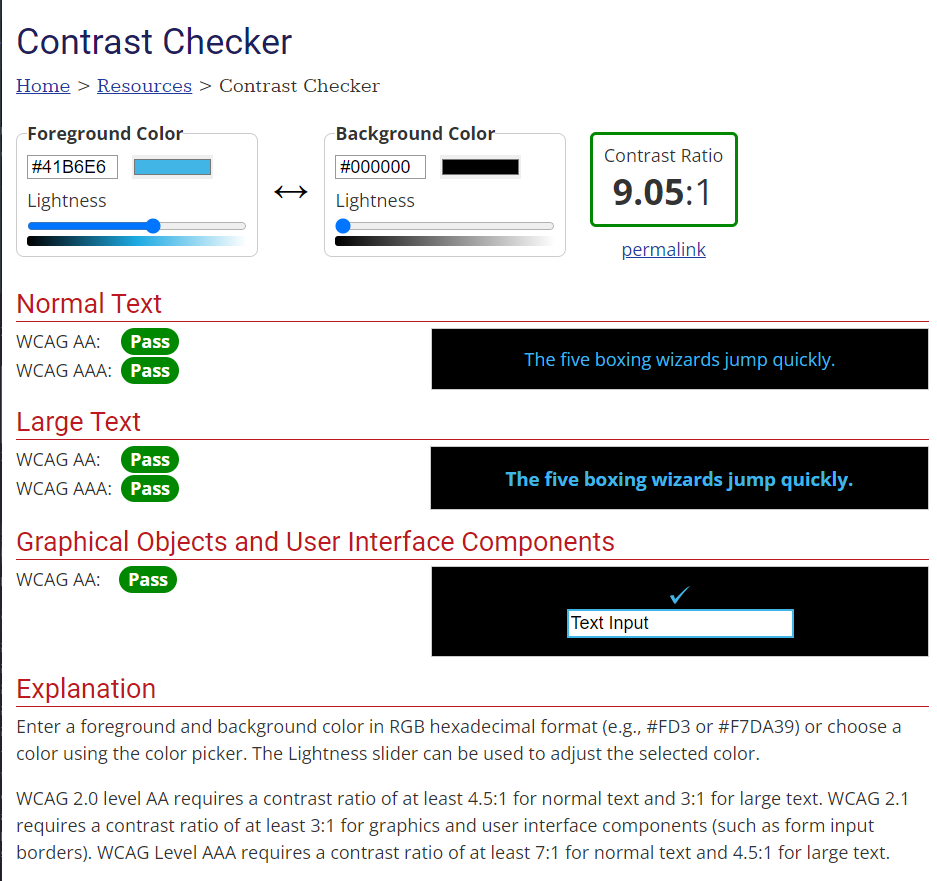
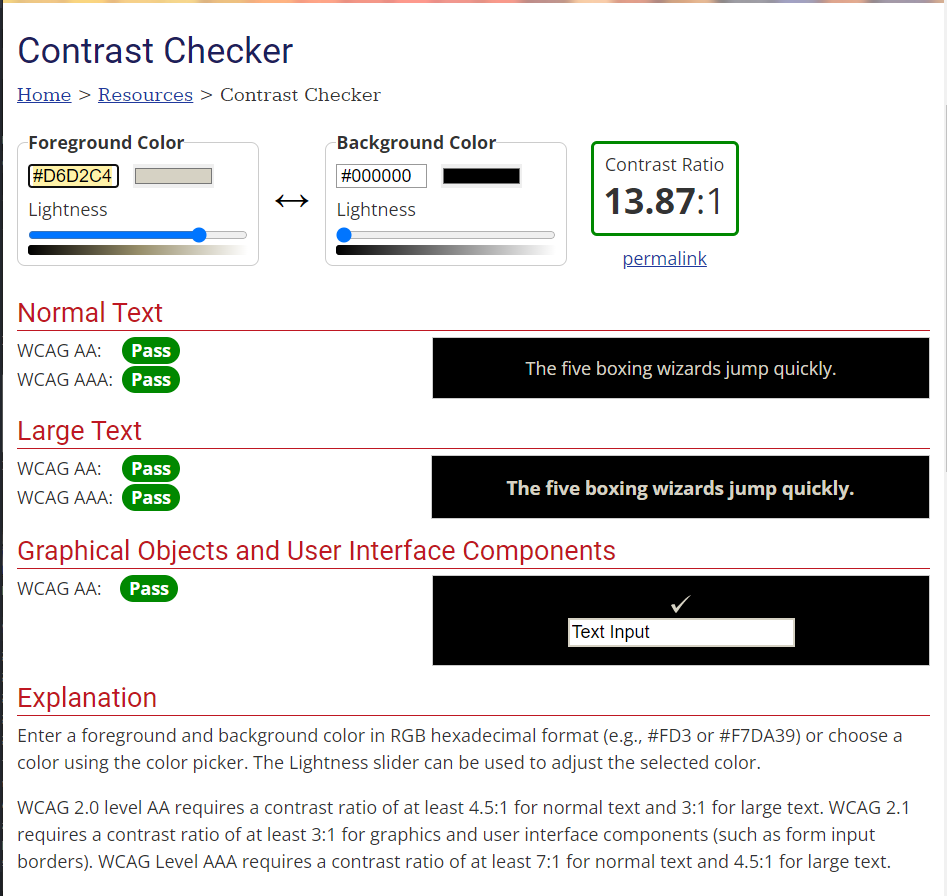
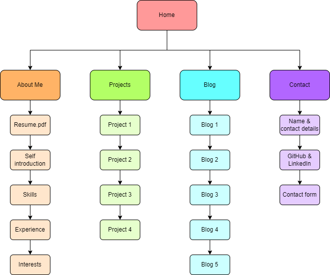
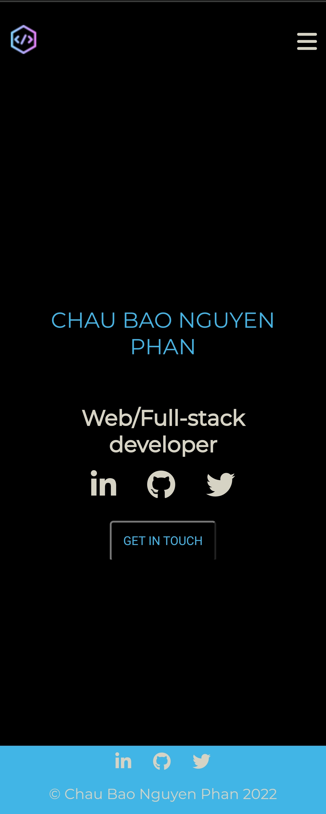
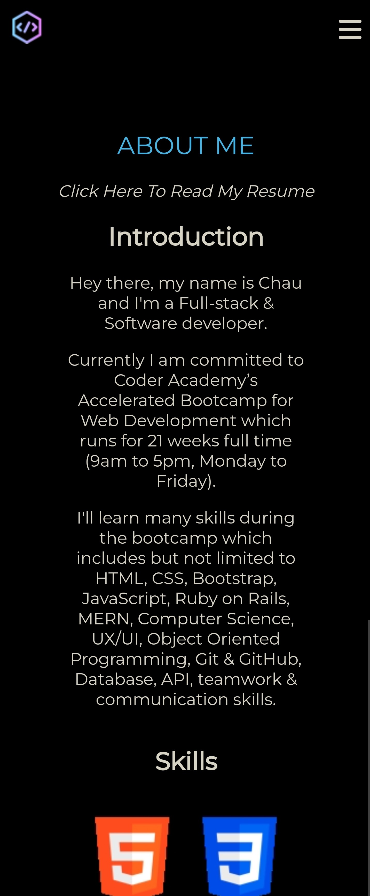
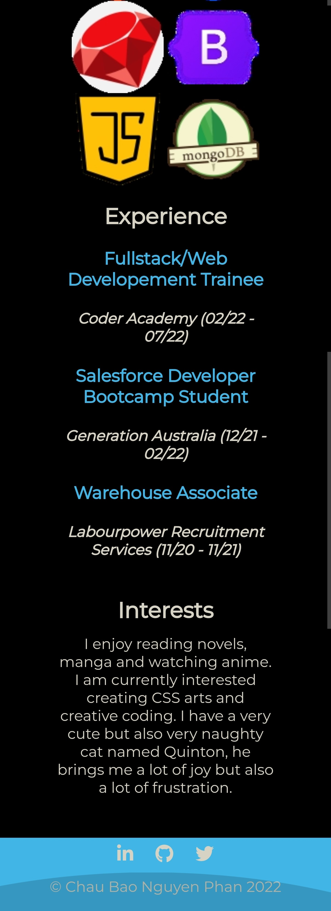
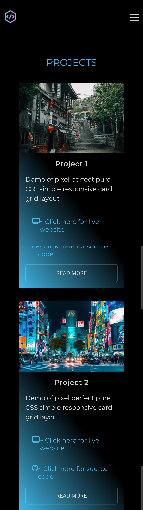
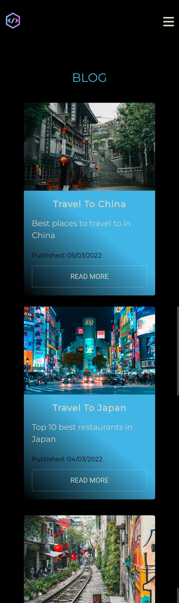
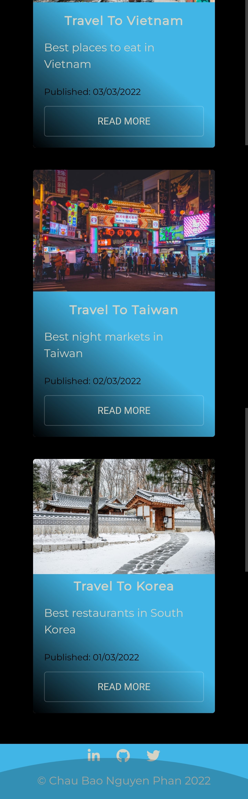
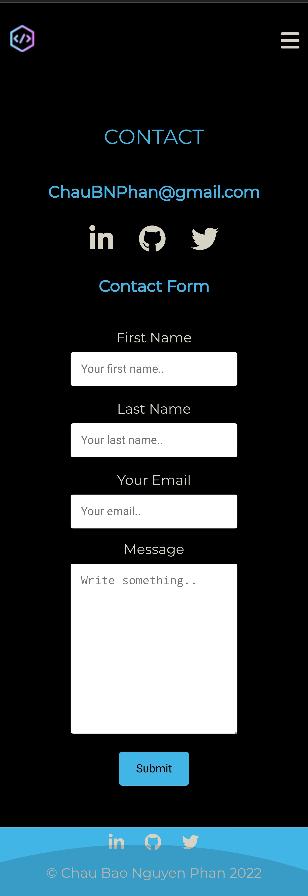

# 1. Portfolio website: 
https://chau-phan.netlify.app/

# 2. Github repo: 
https://github.com/RainInApril/ChauBaoNguyenPhan_T1A2

# 3. Description of portfolio website
## Purpose
As a developer my web portfolio showcase my skills, knowledge and personality with the tech stack used in projects, the porfolio website and blog posts.
## Functionality/Features.
- Website was created with web accessibility in mind using a color pallet that meets the Web Content Accessibility Guidelines (#000000, #41b6e6, #d6d2c4)

- All pages has a logo, a navigation bar and a footer
- The website's logo is linked to the home page
- The navigation bar will become a hamburger menu when viewing on smaller screens
- The bottom border will appear when hovered over Home, About, Projects and Blog navigation links
- Footer includes logo of LinkedIn, GitHub and Twitter which are all linked to my personal account on their platform
- ### Home page
  - Logos linked to personal account on each platform
  - Get In Touch button linked to Contact page
- ### About page
  - A clickable link that will open my resume in a new page
- ### Projects
  - The cards uses flex-wrap
  - Each card includes links to view the project's live and source code
- ### Blog
  - The cards uses flex-wrap
  - Each card includes a button linked to a blog post page
- ### Blog Post
  - Each blog post includes an image
- ### Contact
  - Logos linked to personal account on each platform
  - Contact form is flex-wrapped
  - Visitors can fill out a contact form and it will be sent to my email
## Sitemap

## Portfolio website screenshots
### Home page

### About page

### Project page

### Blog page

### Blog post page

### Contact page

## Target Audience
Employers/recruiters/HR hiring managers/web developers looking to bring new talents to their organisation.

## Tech Stack
  I used HTML, CSS and deployed my website via Netlify.

# Reference
- Accessible Color Palette. 2022. Accessible Color Palette. [ONLINE] Available at: http://www.sussex.ac.uk/tel/resource/tel_website/accessiblecontrast/?q=FFFFFF~003b49~1d4289~94a596~e56db1~d3273e~00bfb2~d6d2c4~ffc845~dc582a~41b6e6~1b365d~be84a3~5d3754~7da1c4~f2c75c~d0d3d4~007a78~000000. [Accessed 04 March 2022].
- Andraware. 2022. Create Responsive Navbar Using HTML and CSS. [ONLINE] Available at: https://www.andraware.com/create-responsive-navbar-using-html-and-css/. [Accessed 04 March 2022].
- WebAIM: Contrast Checker. 2022. WebAIM: Contrast Checker. [ONLINE] Available at: https://webaim.org/resources/contrastchecker/?fcolor=061374&bcolor=A5EAFD. [Accessed 04 March 2022].
- How To Create a Contact Form with CSS. 2022. How To Create a Contact Form with CSS. [ONLINE] Available at: https://www.w3schools.com/howto/howto_css_contact_form.asp. [Accessed 04 March 2022].
- Mahmudul H. Rabby. 2022. Responsive Card Grid Layout. [ONLINE] Available at: https://codepen.io/mahmudulhrabby/pen/GGqdvr. [Accessed 04 March 2022].
- Emma Norris. 2022. The best professional fonts to use for your website. [ONLINE] Available at: https://www.canva.com/learn/best-professional-fonts-use-website/. [Accessed 04 March 2022].
- Flaticon. 2022. Vector Icons and Stickers - PNG, SVG, EPS, PSD and CSS. [ONLINE] Available at: https://www.flaticon.com/. [Accessed 04 March 2022].
- The best Favicon Generator (completely free) - favicon.io. 2022. The best Favicon Generator (completely free) - favicon.io. [ONLINE] Available at: https://favicon.io/. [Accessed 04 March 2022].
